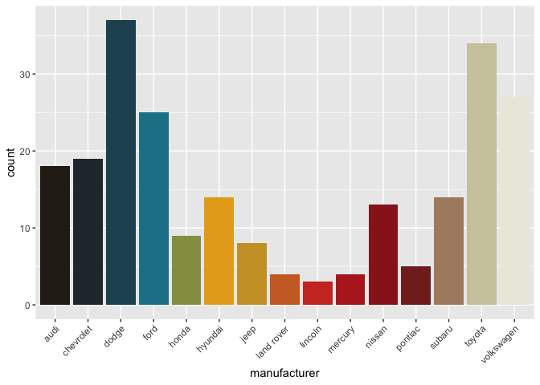

Strokes Palettes Practice
================
Anisha Datta
3/19/2021

``` r
library(ggplot2)
library(tidyverse)
```

    ## ── Attaching packages ─────────────────────────────────────── tidyverse 1.3.0 ──

    ## ✓ tibble  3.1.0     ✓ dplyr   1.0.5
    ## ✓ tidyr   1.1.3     ✓ stringr 1.4.0
    ## ✓ readr   1.4.0     ✓ forcats 0.5.1
    ## ✓ purrr   0.3.4

    ## ── Conflicts ────────────────────────────────────────── tidyverse_conflicts() ──
    ## x dplyr::filter() masks stats::filter()
    ## x dplyr::lag()    masks stats::lag()

# Creating the colors

``` r
strokes_colors <- c(
  `isi yellow`= "#fcc717",
  `isi light blue`= "#40a7df",
  `isi green` = "#1d7360",
  `isi blue`= "#2583ba",
  `isi orange`= "#e0502c",
  `rof midnight` = "#0d2227",
  `rof dark blue`  = "#0d2b3e",
  `rof red` = "#d82a2b",
  `rof yellow`= "#e19925",
  `rof brown`= "#5b2e22",
  `rof blue`= "#1467a3",
  `fioe black`= "#040404",
  `fioe dark grey`= "#585e62",
  `fioe light grey`= "#c7cacd",
  `fioe red`= "#b95049",
  `fioe light red`= "#c86555",
  `angles black`= "#111213",
  `angles greige`= "#d2cbc7",
  `angles yellow` = "#ffcf03",
  `angles pink 1`= "#a52176",
  `angles pink 2`= "#ca1d8a",
  `angles pink 3`= "#e34c9d",
  `angles pink 4`= "#ed5ea3",
  `angles pink 5`= "#f175ac",
  `angles pink 6`= "#f781b6",
  `angles blue 1`= "#2c57a6",
  `angles blue 2`= "#3e5fac",
  `angles blue 3`= "#4967af",
  `angles blue 4`= "#597ab9",
  `angles blue 5`= "#6280be",
  `angles blue 6`= "#7ea1d5",
  `angles blue 7`= "#03a2ca",
  `cm red`= "#b12c2a",
  `cm beige`= "#c1a891",
  `cm light brown`= "#ae7360",
  `cm dark brown`= "#774a40",
  `fpp cream`= "#fbebcb",
  `fpp orange`= "#e24414",
  `fpp yellow`= "#e1af12",
  `fpp red`= "#db2e15",
  `fpp green`= "#18d323",
  `fpp blue`= "#132168",
  `fpp black`= "#1e1c17",
  `na black`= "#2b221c",
  `na dark blue`= "#263b4a",
  `na teal`= "#1d889c",
  `na yellow 1`= "#f0ad1a",
  `na yellow 2` = "#c79e32",
  `na red 1`= "#d33d2d",
  `na red 2`= "#ad2324",
  `na red 3`= "#7f1d1d",
  `na greige`= "#c0b990",
  `na white`= "#eceade"
  
)
```

``` r
strokes_cols <- function(...) {
  
  cols <- c(...)

  if (is.null(cols))
    return (strokes_colors)

  strokes_colors[cols]
}
```

# Creating the palettes

``` r
strokes_palettes<- list (
  
    `is this it` = strokes_cols("isi yellow", "isi light blue", "isi green", "isi blue", "isi orange"),
    
    `room on fire` = strokes_cols("rof midnight","rof dark blue", "rof red", "rof yellow", "rof brown", "rof blue"),
    
    `first impressions of earth` = strokes_cols("fioe black", "fioe dark grey", "fioe light grey", "fioe red", "fioe light red"),
    
    `angles` = strokes_cols("angles black", "angles greige", "angles yellow", "angles pink 1", "angles pink 2", "angles pink 3", "angles pink 4", "angles pink 5", "angles pink 6", "angles blue 1", "angles blue 2", "angles blue 3" , "angles blue 4", "angles blue 5","angles blue 6", "angles blue 7"), 

    `comedown machine` = strokes_cols("cm red","cm beige", "cm light brown", "cm dark brown"),

    `future past present` = strokes_cols("fpp cream", "fpp orange", "fpp yellow","fpp red", "fpp green", "fpp blue", "fpp black"),
    
    `the new abnormal` = strokes_cols("na black", "na dark blue", "na teal", "na yellow 1", "na yellow 2", "na red 1", "na red 2", "na red 3", "na greige", "na white")
    
)
```

``` r
strokes_pal <- function(palette = "is this it", reverse = FALSE, ...) {
  pal <- strokes_palettes[[palette]]

  if (reverse) pal <- rev(pal)

  colorRampPalette(pal, ...)
}
```

``` r
scale_color_strokes <- function(palette = "is this it", discrete = TRUE, reverse = FALSE, ...) {
  pal <- strokes_pal(palette = palette, reverse = reverse)

  if (discrete) {
    discrete_scale("color", paste0("strokes_", palette), palette = pal, ...)
  } else {
    scale_color_gradientn(colours = pal(256), ...)
  }
}
```

``` r
scale_fill_strokes <- function(palette = "is this it", discrete = TRUE, reverse = FALSE, ...) {
  pal <- strokes_pal(palette = palette, reverse = reverse)

  if (discrete) {
    discrete_scale("fill", paste0("strokes_", palette), palette = pal, ...)
  } else {
    scale_fill_gradientn(colours = pal(256), ...)
  }
}
```

# View “is this it” colors by hex number

``` r
strokes_palettes[["is this it"]] %>%
  tibble(x=.) %>%
  mutate(x=fct_inorder(x)) %>%
  ggplot() +
  geom_bar(aes(x, fill=x), position = "fill") +
  scale_fill_identity()+
  theme_minimal()+
  theme(axis.text.x = element_text(angle = 90, hjust=1, vjust=0.5),
        axis.text.y = element_blank(),
        axis.title = element_blank(),
        panel.grid = element_blank())
```

<!-- -->

# Function to visualize palette

``` r
viz_palette <- function(pal, ttl = deparse(substitute(pal)), num = length(pal)) {
    if(num <= 0)
        stop("'num' should be > 0")
    pal_func <- colorRampPalette(pal)
    image(seq_len(num), 1, as.matrix(seq_len(num)), col = pal_func(num), 
          main = paste0(ttl, " (", length(pal), " colors in palette, ", num, " displayed)"), 
          xlab = "", ylab = "", xaxt = "n", yaxt = "n",  bty = "n")
}
```

# Palette Visualizations

## Is This It

``` r
isi_name<-names(strokes_palettes[1])
viz_palette(strokes_palettes$`is this it`, isi_name)
```

<!-- -->

## Room on Fire

``` r
rof_name<-names(strokes_palettes[2])
viz_palette(strokes_palettes$`room on fire`, rof_name)
```

<!-- -->

## First Impressions of Earth

``` r
fioe_name<-names(strokes_palettes[3])
viz_palette(strokes_palettes$`first impressions of earth`, fioe_name)
```

<!-- -->

## Angles

``` r
angles_name<-names(strokes_palettes[4])
viz_palette(strokes_palettes$`angles`, angles_name)
```

<!-- -->

## Comedown Machine

``` r
cm_name<-names(strokes_palettes[5])
viz_palette(strokes_palettes$`comedown machine`, cm_name)
```

<!-- -->

## Future Past Present

``` r
fpp_name<-names(strokes_palettes[6])
viz_palette(strokes_palettes$`future past present`, fpp_name)
```

<!-- -->

## The New Abnormal

``` r
na_name<-names(strokes_palettes[7])
viz_palette(strokes_palettes$`the new abnormal`, na_name)
```

<!-- -->

# View all palettes at once

``` r
pal_names <- names(strokes_palettes)

par(mfrow=c(length(strokes_palettes)/2, 2), lheight = 2, mar=rep(1, 4), adj = 0)
for (i in 1:length(strokes_palettes)){
    viz_palette(strokes_palettes[[i]], pal_names[i])
}
```

<!-- --><!-- -->

## Color by discrete variable using default palette (“is this it”)

``` r
ggplot(iris, aes(Sepal.Width, Sepal.Length, color = Species)) +
    geom_point(size = 4) +
    scale_color_strokes()
```

<!-- -->

## Color by discrete variable using “room on fire” palette

``` r
ggplot(iris, aes(Sepal.Width, Sepal.Length, color = Species)) +
    geom_point(size = 4) +
    scale_color_strokes(palette = "room on fire")
```

<!-- -->

## Color by discrete variable using “first impressions of earth” palette

``` r
ggplot(iris, aes(Sepal.Width, Sepal.Length, color = Species)) +
    geom_point(size = 4) +
    scale_color_strokes(palette = "first impressions of earth")
```

<!-- -->

## Color by discrete variable using “angles” palette

``` r
ggplot(iris, aes(Sepal.Width, Sepal.Length, color = Species)) +
    geom_point(size = 4) +
    scale_color_strokes(palette="angles")
```

<!-- -->

## Color by discrete variable using “comedown machine” palette

``` r
ggplot(iris, aes(Sepal.Width, Sepal.Length, color = Species)) +
    geom_point(size = 4) +
    scale_color_strokes(palette= "comedown machine")
```

<!-- -->

## Color by discrete variable using “future past present” palette

``` r
ggplot(iris, aes(Sepal.Width, Sepal.Length, color = Species)) +
    geom_point(size = 4) +
    scale_color_strokes(palette = "future past present")
```

<!-- -->

## Color by discrete variable using “the new abnormal” palette

``` r
ggplot(iris, aes(Sepal.Width, Sepal.Length, color = Species)) +
    geom_point(size = 4) +
    scale_color_strokes(palette = "the new abnormal")
```

<!-- -->

## Color by numeric variable with default palette (“is this it”)

``` r
ggplot(iris, aes(Sepal.Width, Sepal.Length, color = Sepal.Length)) +
    geom_point(size = 4, alpha = .6) +
    scale_color_strokes(discrete = FALSE)
```

<!-- -->

## Color by numeric variable with “room on fire” palette

``` r
ggplot(iris, aes(Sepal.Width, Sepal.Length, color = Sepal.Length)) +
    geom_point(size = 4, alpha = .6) +
    scale_color_strokes(discrete = FALSE, palette = "room on fire" )
```

<!-- -->

## Color by numeric variable with “first impressions of earth” palette

``` r
ggplot(iris, aes(Sepal.Width, Sepal.Length, color = Sepal.Length)) +
    geom_point(size = 4, alpha = .6) +
    scale_color_strokes(discrete = FALSE, palette = "first impressions of earth" )
```

<!-- -->

## Color by numeric variable with “first impressions of earth” palette

``` r
ggplot(iris, aes(Sepal.Width, Sepal.Length, color = Sepal.Length)) +
    geom_point(size = 4, alpha = .6) +
    scale_color_strokes(discrete = FALSE, palette = "angles" )
```

<!-- -->

## Color by numeric variable with “comedown machine” palette

``` r
ggplot(iris, aes(Sepal.Width, Sepal.Length, color = Sepal.Length)) +
    geom_point(size = 4, alpha = .6) +
    scale_color_strokes(discrete = FALSE, palette = "comedown machine" )
```

<!-- -->

## Color by numeric variable with “future past present” palette

``` r
ggplot(iris, aes(Sepal.Width, Sepal.Length, color = Sepal.Length)) +
    geom_point(size = 4, alpha = .6) +
    scale_color_strokes(discrete = FALSE, palette = "future past present" )
```

<!-- -->

## Color by numeric variable with “the new abnormal” palette

``` r
ggplot(iris, aes(Sepal.Width, Sepal.Length, color = Sepal.Length)) +
    geom_point(size = 4, alpha = .6) +
    scale_color_strokes(discrete = FALSE, palette = "the new abnormal")
```

<!-- -->

## Fill by discrete variable with “is this it” palette

``` r
ggplot(mpg, aes(manufacturer, fill = manufacturer)) +
    geom_bar() +
    theme(axis.text.x = element_text(angle = 45, hjust = 1)) +
    scale_fill_strokes(palette = "is this it", guide = "none")
```

<!-- -->

## Fill by discrete variable with “room on fire” palette

``` r
ggplot(mpg, aes(manufacturer, fill = manufacturer)) +
    geom_bar() +
    theme(axis.text.x = element_text(angle = 45, hjust = 1)) +
    scale_fill_strokes(palette = "room on fire", guide = "none")
```

<!-- -->

## Fill by discrete variable with “angles” palette

``` r
ggplot(mpg, aes(manufacturer, fill = manufacturer)) +
    geom_bar() +
    theme(axis.text.x = element_text(angle = 45, hjust = 1)) +
    scale_fill_strokes(palette = "angles", guide = "none")
```

<!-- -->

## Fill by discrete variable with “comedown machine” palette

``` r
ggplot(mpg, aes(manufacturer, fill = manufacturer)) +
    geom_bar() +
    theme(axis.text.x = element_text(angle = 45, hjust = 1)) +
    scale_fill_strokes(palette = "comedown machine", guide = "none")
```

<!-- -->

## Fill by discrete variable with “future past present” palette

``` r
ggplot(mpg, aes(manufacturer, fill = manufacturer)) +
    geom_bar() +
    theme(axis.text.x = element_text(angle = 45, hjust = 1)) +
    scale_fill_strokes(palette = "future past present", guide = "none")
```

<!-- -->

## Fill by discrete variable with “the new abnormal” palette

``` r
ggplot(mpg, aes(manufacturer, fill = manufacturer)) +
    geom_bar() +
    theme(axis.text.x = element_text(angle = 45, hjust = 1)) +
    scale_fill_strokes(palette = "the new abnormal", guide = "none")
```

<!-- -->
